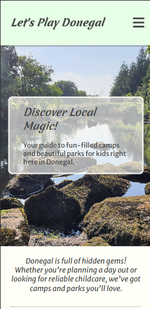
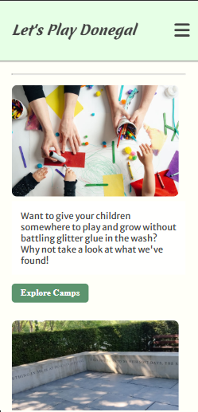
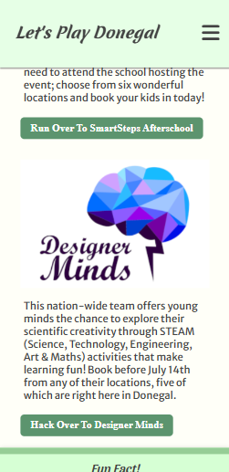
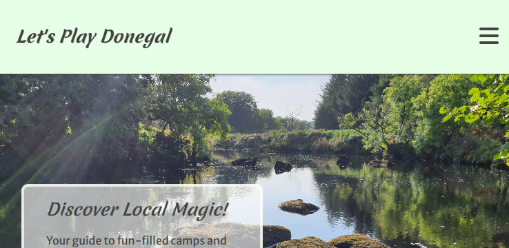
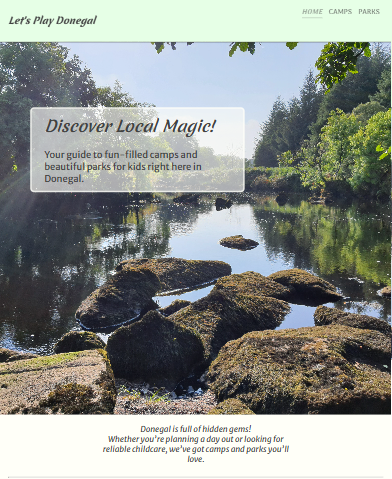
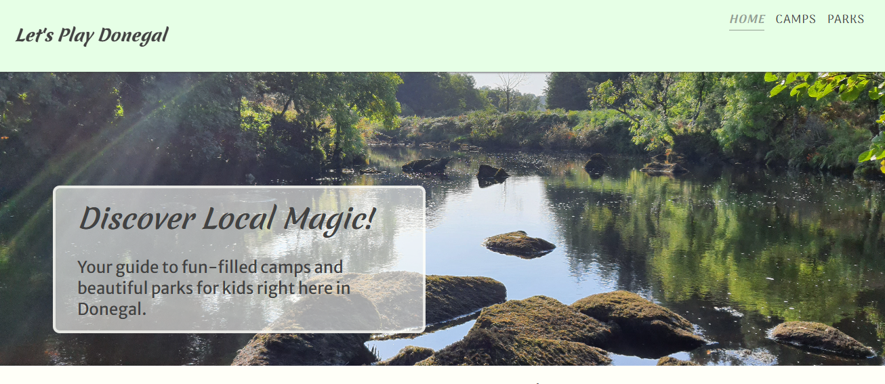

#### User-Centric-Milestone-Project
Visit our website: [Let's Play Donegal](https://beckyem.github.io/User-Centric-Milestone-Project/)

# About
This project is designed to provide parents/guardians with a list of outdoor activities to do in Co. Donegal that can either be for the kids, or for the whole family.

# User Story
Mary is a 38 year old, Donegal mother who wants to help her kids make the most of their summer, but she's not too sure what's on offer in her local area.
- She googles 'Summer Camps in Donegal' on her phone and comes across our website.

- Taking a brief look at what this website is about, she clicks the button to find out what camp recomendations Let's Play Donegal has to offer. 
- After reading a few descriptions, she decides she'd like to learn more about 'Designer Minds' and clicks on the button to open the website in a new tab. 

# Responsive Design
- Mobile Device (Portrait)

- Mobile Device (Landscape)

- Tablet Device

- Laptop Devices & Larger

# Testing Documentation
You can see the testing plan and implementation notes [here](https://github.com/Beckyem/User-Centric-Milestone-Project/blob/main/Testing.md).

# Acknowledgements
In the making of this project, some material was copied from fontawesome.com, favicon.io, fonts.google.com, and w3schools.com (as cited in comments of documents).