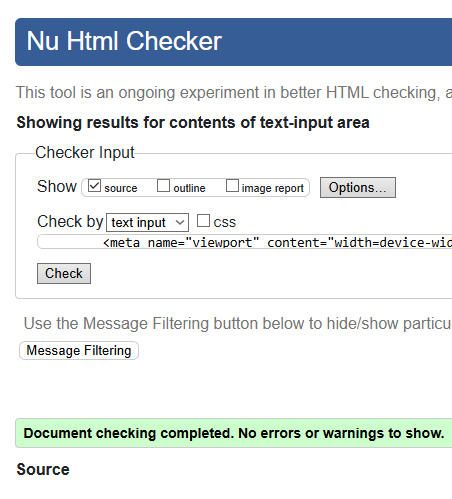
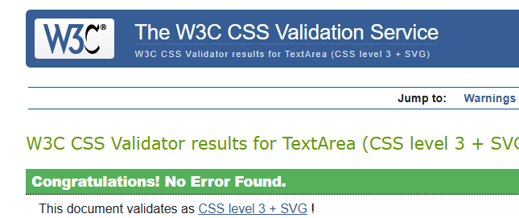

# Testing Plan
The following are the intended series of tests intended to guide me to a better, working website. Starting with:
### Deployment
1. Launch initial dummy template as website on Github Pages and follow link.
2. Ensure all links to favicon/files and images still work (that you've used relative file pathing instead of absolute).
3. Search for deployed website using meta tags inserted into header with a search engine and see how long it takes to find (amend tags as necessary to make it easier).
- Website was properly deployed on Github Pages (as seen here at [Let's Play Donegal!](https://beckyem.github.io/User-Centric-Milestone-Project/index.html)).
-The favicon works, but I didn't have time to make one that was theme appropriate, so that will have to do for now.
- SEO attempt was a complete flop. Not entierly sure where I'm going wrong here.
### File Links (Internal)
1. Test that the styels.css is correctly linked to the documents with striking colors.
2. Amend / Remove after successful test.
- All files are linked correctly (had some really weird colours to make sure the elements were getting targeted) and changed the styles as needed.
### Hyperlinks (Internal)
1. Click on each navigation link to see if it takes you to the next page.
2. Click on each anchor link to see if it takes you to the right part of the page.
- Navigation works as intended, didn't ad any anchor links in the end.
### Hyperlinks (External)
1. Ensure link opens url in new tab by clicking on them.
- Had no problem with this. All link buttons open into their respective websites (though the social media section just goes to the main homepage of those sites because this isn't a real thing.. Yet).
### Responsive Check
1. Drag widnow left and right to ensure all internal elements resize/reorganise as intended.
2. Ensure any images (set to change per screen width) switch to resolution appropriate equivalents.
 - Had a lot of tweaking with this, but eventually I got it all sorted. Biggest issue was with how I was handling the margins, so I eventually cut that down to one area.
### Image Details
1. Remove href atribute from image elements in HTML files to see if the alt attribute correctly displays description of image.
2. Ensure that the images swap to larger versions as the screen grows in size.
- All images displayed their alt descriptions (after I added the aria-label for the #hero section), but I couldn't figure out how to swap the images for better resolution ones as the device changed widths (room for growth).
### Code Validation
1. Insert deployed webpage(s) code into the W3C HTML Validator and amend any/all errors.
2. Insert deployed webpage stylesheet into W3C Jackbox Validator and amend any/all errors.

- Used the [HTML5 Validator](https://validator.w3.org/nu/#textarea) to test all three pages, and fixed the issues that came up (mostly that I had left '/' at the end of void tags) as seen here 
- Used the [CSS3 Jigsaw Validator](https://jigsaw.w3.org/css-validator/validator#warnings) to test the style.css file and had no issues 
